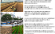
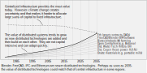

Includes: agroforestry, farmland, habitat, housing, Ethereum, FreeCAD, Blender, BIM, IFC

---

**SUMMARY**

An experimental one hectare (2.5 acre) agroforestry home that requires no public utilities. The home has the potential to be carbon-negative while ensuring access to energy, food, water, and habitat as the climate changes over the next 100 years.

The project is funded through to the year 2035.

**OVERVIEW**

During the late 1990's, the Canadian Mortgage and Housing Corporation (CMHC) sponsored the development of a [home, within the city of Toronto, that required no public water, sewer, or gas utilities and that provided most of its electrical power](http://www3.sympatico.ca/rolf/howtoronto.html). The home was integrated with a garden that captured nutrients and played a role in the home's water cycle.  The idea was that homes like this would have less environmental impact and could be sited at lower cost without public infrastructure.  Further, since these homes can function after natural disasters that shut down public infrastructure, having a certain percentage of them in a region could make communities more secure.  The concept was visionary and it worked, however, one difficulty was that the technology did not align well with cities that were starting to focus on densification.

The Hundred-Year-Farm project builds on the Toronto Healthy House concept with the benefit of another twenty years of significant technology advances.  Rather than cities, the intended use is for homes on small acreages outside of cities where there are no public utilities, well, or septic system, and where the land is degrading from changes to climate or is otherwise poorly suited to agribusiness.  The home is expected to halt degradation of that land, then allow for a gradual restoration of its habitat, food, and energy production while serving as a carbon-sink.  This application aligns with the interests of cities and agribusiness.

The project is located on a 42 acre parcel of land.  Much of the property is judged by the owners to be at-risk of fire, erosion, and habitat loss if the climate continues to warm over the next few decades.  

The land will be treated in three different ways.

1) Most of the forested area (a former clear-cut) will be left as-is, apart from thinning where needed for tree health.  This continues the generally accepted practices of today.

2) Some cleared areas will be replanted with trees through government reforestry programs that are designed to help address the changing climate.

3) The third treatment will be a 2.5 acre carbon-negative agroforestry household.  Even with the footprint of the home, we expect carbon sinking, habitat, food and energy production to be the highest with this option.  This is largely because with people on-site it is possible to establish a more diverse population of native trees and habitat (including ponds for birds) than the clear-cut regrowth or reforestry programs.  The on-site production of food and energy provides further benefit when compared to a similiar household in the city.  

A planned third-party life-cycle assessment will allow us to compare results from the three options and help the farm make a decision on how to proceed for the next 100 years.  

Assuming successful technology development, manufactured components for the cogeneration systems are also possible as is the development of a carbon-negative housing development (2.5 acre lots).  In the shorter-term, lessons learned during research and development of low-carbon technologies for the future can provide a great deal of in-sight into other early investment opportunities with higher than average returns.  That has, so far, been a successful strategy and it is those returns that are funding this project going forward without grant, subsidy, or loans.

**PROJECT MILESTONES**

***Past***

2010: Developed the concept for a carbon-negative agroforesty home.

2013: Purchased farmland.

2016: Made early investments in technologies that would be needed in a climate changing world.   In particular, water technologies and technologies that automate project work in equipment manufacturing co-ops and housing developments.

2019: Initial design of the carbon-negative co-generation system.

2021: Started work on the co-generation prototype, buildings, food trails, and computer models.

***Present***

The graphic below illustrates some of the project's 2022 activities.   

Current project plans are to use a [cogeneration system](https://www.energy.gov/eere/amo/combined-heat-and-power-basics) supplemented with solar photovoltaics to provide the home with its space heating, hot water, electricity, and water purification. Yard and wood waste will be the home's biofuel with nutrients, and especially nitrogen, that the system generates being captured for use onsite. When also producing char for soil improvement, that co-generation system can become carbon negative.  The technology to do this is not new, but it still requires significant development for cost reduction before it will be economically viable in general use.  

***Future***

Technology development is, of course, difficult to predict.  Ethereum, for example, has the potential to significantly reduce the cost of delivering low-carbon technologies but it is still an immature technology with a great deal of regulatory uncertainty requiring clarification.  Advances in water purification technologies along with tools, such as AI and robotics for growing plants, could prove equally important.  

Assuming success by the communities developing the various distributed technologies this project relies upon, the following timelines should be achievable.

**2023-2030**: Construction of the carbon-negative household through three stages:

- A carbon-negative workshop or office (1 person 8 hours per day).

- A carbon-negative summer home for two people.

- A carbon-negative year-round home for two people in a climate with cold winters.

**2030-2035**: Publish the life-cycle assessment.

**OWNERS**

Nancy and Brenon both grew up on small farms. Brenon worked in the development and manufacture of distributed co-generation power systems and later in the engineering of large public utilities. Nancy managed projects for new technology product development and hardware prototyping. Both have developed a keen interest in the relationship between secure communities, housing, and biodiversity in this time of changing climate and technology.

You can email the project at hund---yearfar-s @ protonmail.com.

---

**SUPPLEMENTARY REFERENCE MATERIAL**

***Agroforestry***

Agroforestry is the practice of planting crops among trees. The trees protect the crops from wind, heat, and water extremes such as those predicted by climate models. In general, total food productivity from agroforestry is about the same per acre as agribusiness, but it can be more reliable, support habitat, and is better suited to small scale farms with a single household. 

One hectare of agroforestry was chosen for this project since that is roughly how much land it takes, in principle, to supply a small carbon-negative household with its food, water, and energy needs.  One hectare is 2.5 acres, or about half a residential city block.  For reference, there is about two hectares (5 acres) of productive arable land available to every household on earth.  

- [What is agroforestry?](https://www.aftaweb.org/)

- [Agroforestry - UK](https://www.agforward.eu/index.php/en/silvoarable-agroforestry-in-the-uk.html)

- [Agroforestry - US](https://www.fs.usda.gov/nac/about/why-agroforestry.php)

***Cogeneration***

In climates with a winter season, cogeneration can supply homes with space heating and hot water as well as electrical power during the night and cloudy winter days.  Critically, they can help process water for re-use, produce solid carbon for soil amendment, and they can generate nitrogen rich fertilizers.  These systems complement photovoltaics which are most effective when producing electricity during the summer with its long hours of daylight.  Co-generation is a well-known and proven technology, but is not yet cost effective for typical households.  We think it could become cost-effective in our application within the next decade or so.

- [Cogeneration - US Department of Energy](https://www.energy.gov/eere/amo/combined-heat-and-power-basics)

- [Micropower Connect - NRCAN](https://www.nrcan.gc.ca/sites/www.nrcan.gc.ca/files/canmetenergy/files/pubs/2006-073_%2528TR%2529_411-INTERC_Connecting_MicroPower_to_the_Grid_2nd_Edition.pdf)

- [Biomass Gassification - Energy and Environmental Science](https://pubs.rsc.org/en/content/articlepdf/2016/ee/c6ee00935b)

- [Cogen example - heat and electricity at Scotston Farm](https://www.youtube.com/watch?v=i9xmWJ4hAGs)

- [Cogen example - heat and char at Burt's Greenhouse](https://biochar-international.org/burtsgreenhouse/)

- [Cogen example - heat and char by the City of Stockholm](https://www.stockholmvattenochavfall.se/en/current-projects/development/biochar/#!/about-the-biochar-project)

- [Cogen biomass generator](https://www.allpowerlabs.com/products/product-overview)

***Design and Coordination (Blender, FreeCAD, IFC, and Ethereum)***

The design and then tracking of buildings,  equipment, crops, and habitat over time is a difficult problem.  That is especially true if the data is to be used for long-term research and scientific purposes.  To manage data we will be using a 3D file system rather than 2D file/folder structure.  In addition to buildings and equipment, this approach allows, as an example, for the history of a fruit tree to be obtained by selecting it from the 3D model.  That history may include a given tree's supplier, year planted, species, cost, tax depreciation, maintenance, yield, and height over time, among other parameters.  Below is a description of the software we are using to build such a digital twin of the project (see also the above illustration under the Milestones heading).

<u>**Blender**</u>, often used by artists, is a 3D modelling tool for visualizing and communicating project information. We use Blender to model the overall property, site layout, crops, and trees. With Blender's use of GIS and [BIM (IFC standards)]([BlenderBIM Add-on - Which IFC class should I use?](https://blenderbim.org/search-ifc-class.html)) it should prove useful when working with planners, landscape architects, biologists, agronomists, among others.  

<u>**FreeCAD**</u>  is a 3D modelling tool typically used by skilled trades and engineers.   In our project it is used to design metal parts for the co-gen system and we use it to detail building construction (e.g. wall framing).  FreeCAD is generally used when more precision and design computation (e.g. heat flow) is needed than Blender is designed for.  FreeCAD, like Blender, can use IFC for data exchange.  The project will use this software when working with house builders, machinists, welders, and others.

<u>[**IFC**]([Industry Foundation Classes (IFC) - buildingSMART International](https://www.buildingsmart.org/standards/bsi-standards/industry-foundation-classes/))</u> , or **I**ndustry **F**oundation **C**lass is an open standard for exchanging information about the physical world.  It is used to describe the built environment (buildings, equipment, roads, and infrastructure) as both a 3D geometry and a semantic language which helps machines reason about the model.  The next edition of IFC will include landscapes which we will use to model the crop and forestry aspect of our project.  IFC is commonly used by regional and municipal governments in BIM projects which means our project data is likely to be compatible with agencies we work with.  Since IFC is used for infrastructure, it is likely to remain relevant for many decades.   

<u>**Ethereum**</u> is a coordinating smart-contract platform that has the long-term potential to automate business processes and, in doing so, reduce the cost of delivering low-carbon technologies and homes.  It could, for example, make manufacturing co-ops cost effective once again (e.g. DAOs for co-gen systems and kit houses) and it could automate much of the administrative costs of housing developments.  Distributed and automated KYC/AML/ATF , accounting, finance, tax payments, and especially voluntary standards and certification programs for ethics and consumer protection, among others, are still needed for this technology to mature over the coming decades.  Ethereum integration with IFC's semantics  should allow smart contracts to reason about the physical asset being represented and tied to its transactions.   The [Ernst & Young Global Blockchain Summit]([EY Global Blockchain Summit](https://pub.ey.com/public/2021/2112/2112-3933703/blockchain-summit-2022/index.html#events)) describes some of the more promising ways we see Ethereum being used in our project.

The image below illustrates how the above software (Blender, FreeCAD, and Ethereum) can be used as part of a growing set of distributed technologies.  Over the coming decades, those technologies could help deliver new low-carbon technologies and lower-cost housing options in regions that lack capital for large scale infrastructure projects.

- [DAO cooperatives](https://medium.com/nexus-mutual/digital-cooperatives-are-the-future-2b0772c1e03a)

- [US Federal Reserve - Smart Contract Research Report](https://research.stlouisfed.org/publications/review/2021/02/05/decentralized-finance-on-blockchain-and-smart-contract-based-financial-markets)

- [UNICEF's Innovation Fund for Blockchain Technologies](https://www.unicef.org/innovation/stories/Fundblockchain6months)

- [OASIS Standards Body - Baseline Protocol for Smart Contracts](https://docs.baseline-protocol.org/baseline-protocol/architecture)

- [Microsoft using Ethereum Technology in their Supply Chain](https://cloudblogs.microsoft.com/industry-blog/manufacturing/2020/12/17/improve-supply-chain-resiliency-traceability-and-predictability-with-blockchain/)

- [DAO Legislation](https://www.wyoleg.gov/Legislation/2021/SF0038#-408)

- [Gitcoin Grants](https://gitcoin.co/blog/gitcoin-grants/)

**[Image Credits]([Openverse &#124; WordPress.org](https://wordpress.org/openverse/search/?q=farm))**

[Agribusiness](https://www.flickr.com/photos/48631399@N07/16145919580) by [ukagriculture](https://www.flickr.com/photos/48631399@N07) is licensed under [CC BY-NC-ND 2.0](https://creativecommons.org/licenses/by-nd-nc/2.0/jp/?ref=openverse).

[Metra Electric Line, Chicago Illinois]([Metra Electric Line, Chicago, Illinois | The Metra Electric … | Flickr](https://www.flickr.com/photos/75683070@N00/9179520017))

[Preventing desertification](https://www.flickr.com/photos/75478114@N00/3861819575) by [Bert van Dijk](https://www.flickr.com/photos/75478114@N00) is licensed under [CC BY-NC-SA 2.0](https://creativecommons.org/licenses/by-nc-sa/2.0/?ref=openverse).

[[Wakelyns Agroforestry](https://www.flickr.com/photos/120950867@N08/15061985765)" by [agforward](https://www.flickr.com/photos/120950867@N08) is licensed under [CC BY-NC-SA 2.0](https://creativecommons.org/licenses/by-nc-sa/2.0/?ref=openverse).

Page updated 2022-08-15 by Leslie (Brenon) Knaggs, Nancy Knaggs
